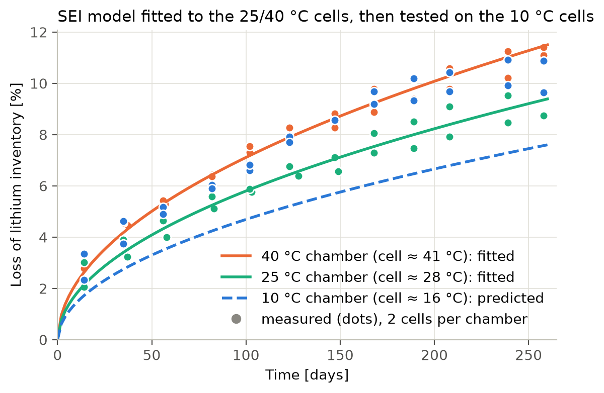
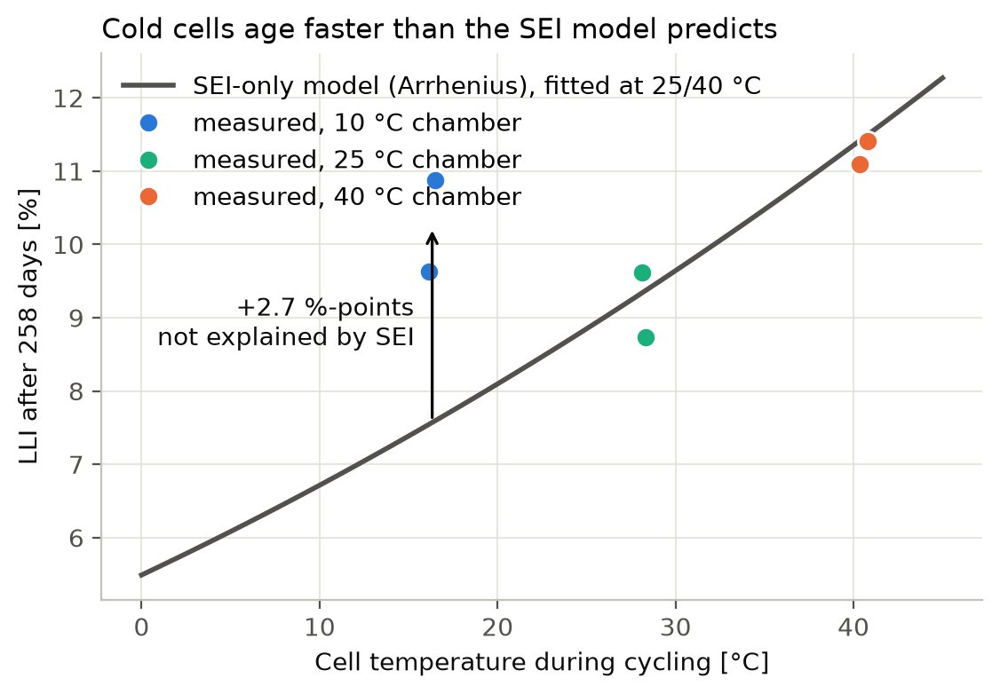
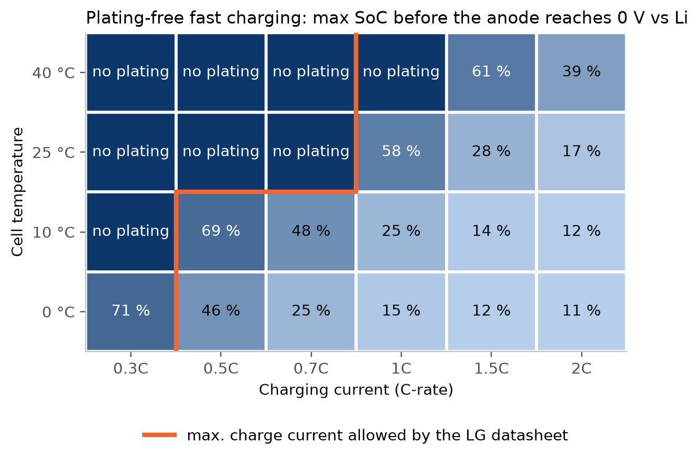

# Li-ion cell ageing with PyBaMM

This project fits a physics-based SEI growth model to open ageing data of a commercial 21700 cell (LG M50T, NMC811 cathode, graphite–SiOx anode). It then tests the model at a temperature it has not seen, checks lithium plating as an explanation where the model fails, and uses the model to derive a plating-free fast-charging map for system simulation.

## Summary

- **SEI growth identified from measurements.**
  - Fitted to the lithium loss of four cells cycled at 28 °C and 41 °C (cell surface temperature).
  - Parameters: diffusion-limited SEI with a solvent diffusivity of 4.6 × 10⁻²⁰ m²/s at 25 °C and an activation energy of **25.6 ± 3.9 kJ/mol**.
  - Fit quality: RMSE of **0.39 %-points** of lithium inventory.
- **The model fails for the cold cells.**
  - The cells in the 10 °C chamber (16 °C at the cell surface) lost **10.3 %** of their cyclable lithium in 258 days; the SEI model predicts **7.6 %**.
  - Of the three temperatures tested, loss is lowest at 28 °C and rises both hotter and colder. This is non-Arrhenius, the V-shape known from post-mortem studies (Waldmann et al., 2014).
- **Lithium plating does not explain the gap, with these parameters.**
  - During the test's 0.3C charges, the anode never falls below **+27 mV vs Li/Li⁺**.
  - The plating model accounts for **0.44 of the 2.7 %-points** missing at 16 °C.
- **Practical output: a plating-free charging map.**
  - A DFN (Doyle–Fuller–Newman) model gives the SoC at which constant-current charging starts to plate, for 0–40 °C and 0.3C–2C ([`results/fast_charge_limits.csv`](results/fast_charge_limits.csv)).
  - It was not tuned to the datasheet, yet it reproduces LG's charge-current limits: 0.3C below 25 °C, 0.7C from 25 to 45 °C. It is stricter than the datasheet only at 0 °C.

## The question

Kirkaldy et al. (2024) cycled LG M50T cells between 70 and 85 % state of charge (SoC), charging at 0.3C and discharging at 1C. The cells sat in chambers at 10, 25 and 40 °C, two per chamber, for 258 days and 6,204 cycles. Every ~3 weeks a check-up measured the capacity and, from the open-circuit voltage, the **loss of lithium inventory (LLI)**, i.e. lithium that can no longer shuttle between the electrodes.

**Can a physics-based model identified at two temperatures predict the third?**

## Results

### 1. SEI growth, identified at 28 and 41 °C



| Parameter (PyBaMM name) | Fitted value (95 % CI) | O'Kane 2022 default |
|---|---|---|
| SEI solvent diffusivity at 25 °C [m²/s] | 4.6 × 10⁻²⁰ (log₁₀: −19.33 ± 0.03) | 2.5 × 10⁻²² |
| SEI growth activation energy [kJ/mol] | 25.6 ± 3.9 | 38 |

| Cells | RMSE [%-points LLI] |
|---|---|
| 25 and 40 °C chambers (training) | 0.39 |
| 10 °C chamber (test) | 2.56 |

The measured LLI grows as √t, the signature of SEI growth limited by solvent diffusion through the existing film.

### 2. The cold cells age faster than SEI growth allows



- **Use the measured temperatures.** The chamber setpoints hide the real conditions. Self-heating during cycling put the cell surface at **16.3, 28.2 and 40.6 °C** in the 10, 25 and 40 °C chambers, and the model uses these measured temperatures.
- **The cold cells still don't fit.** Even so, the 16 °C cells lost more lithium than the 28 °C cells, and an Arrhenius SEI model cannot produce that. An additional mechanism that grows toward low temperature is at work.

### 3. Is it lithium plating?

Lithium plating is the usual suspect at low temperature: lithium deposits as metal instead of entering the graphite. The check simulates 20 cycles of the test protocol with a DFN model. It combines the fitted SEI model with O'Kane et al.'s partially reversible plating model.

| Chamber | Cell temperature | Lowest anode potential vs Li/Li⁺ | Lithium lost to plating over the test |
|---|---|---|---|
| 10 °C | 16.3 °C | +27 mV | 0.44 % |
| 25 °C | 28.2 °C | +47 mV | 0.22 % |
| 40 °C | 40.6 °C | +61 mV | 0.09 % |

- **Plating grows toward the cold, as expected,** but it covers only about a sixth of the 2.7 %-point gap.
- **There is no driving force for bulk plating.** The anode stays above 0 V vs Li/Li⁺ throughout.
- **The margin is small.** 27 mV is thin enough that local effects a 1D model cannot resolve could still matter, for example uneven current near the electrode edges or the silicon phase.
- **Conclusion:** with published parameters, plating is a minor contributor. The dominant cold mechanism remains open; see [Next steps](#next-steps).

### 4. Plating-free fast-charging map



Each cell of the map gives the SoC at which a constant-current charge from 10 % SoC first drives the anode to 0 V vs Li/Li⁺, the standard plating criterion. [`results/fast_charge_limits.csv`](results/fast_charge_limits.csv) holds the same numbers as a lookup table (temperature × C-rate), for example for a 2-D lookup block in a system or BMS simulation. The value 100 means the 4.2 V limit is reached without plating.

**Check against the manufacturer:** LG's product specification allows at most **0.3C at 0–25 °C and 0.7C at 25–45 °C** (orange line).
- All combinations the datasheet allows at 10, 25 and 40 °C are plating-free in the model.
- Beyond the limit, the model plates part-way through the charge, for example 0.5C at 10 °C from 69 % SoC and 1C at 25 °C from 58 % SoC.
- At 0 °C the model is stricter than the datasheet: 0.3C plates from 71 % SoC.

## Method

- **Model.** [PyBaMM](https://pybamm.org) 26.8 with the `OKane2022` parameter set for the LG M50 cell.
  - SEI fit: single particle model (SPM) with `"SEI": "solvent-diffusion limited"`.
  - Plating check and map: Doyle–Fuller–Newman (DFN) model.
- **SEI growth law.**
  - The SEI current density is

    $$j_\mathrm{SEI} = -\frac{D_\mathrm{sol}\,c_\mathrm{sol}\,F}{L_\mathrm{SEI}}\,\exp\left[\frac{E_a}{R}\left(\frac{1}{T_\mathrm{ref}}-\frac{1}{T}\right)\right]$$

  - Because the rate is inversely proportional to the film thickness $L_\mathrm{SEI}$, the film grows (and consumes lithium) as $\sqrt{t}$.
- **Cycling as storage.**
  - $j_\mathrm{SEI}$ does not depend on the current, so 6,204 cycles age this model exactly like 258 days of storage at the same temperature. Each fit evaluation therefore takes a fraction of a second instead of simulating every cycle.
  - [`fit_sei.py`](fit_sei.py) asserts this against 20 simulated cycles; both give 0.3512 % LLI.
- **Parameter identification.**
  - `scipy.optimize.least_squares` on log₁₀ $D_\mathrm{sol}$ and $E_a$, against 48 LLI check-ups from the 25 and 40 °C chambers.
  - Each cell uses its mean measured surface temperature.
  - 95 % confidence intervals come from the Jacobian at the optimum.
- **Validation.** Prediction for the held-out 10 °C chamber cells.
- **Plating.**
  - DFN model with the fitted SEI plus `"lithium plating": "partially reversible"`, simulating 20 cycles of the test protocol.
  - The settled per-cycle loss (second half of the run) is extrapolated to all 6,204 cycles.
- **Map.**
  - DFN model of a fresh, isothermal cell, charged at constant current from 10 % SoC.
  - Criterion: $\phi_s-\phi_e < 0$ V at the anode/separator interface, where the anode potential is lowest during charging.

## Limitations

- **Anode.** The anode is a graphite–SiOx composite. The model treats it as a single phase, using the open-circuit potential measured on the harvested composite electrode (Chen et al., 2020).
- **Time and temperature inputs.**
  - The "days of degradation" include the check-up periods at 25 °C.
  - The temperature is measured at the cell surface; the core runs warmer during cycling.
- **Confidence intervals.** They assume independent errors, but repeated check-ups of one cell are correlated, so the true uncertainty is larger.
- **Plating kinetics.** They come from O'Kane et al. (2022) and were not identified from these cells.
- **Map assumptions.** The map is for a fresh cell at fixed temperature with a constant current.
  - Self-heating during fast charging lowers the plating risk.
  - Ageing raises it.
- **Scope.** Only one SoC window (70–85 %) is used.

## Next steps

- **Identify the cold mechanism.** The same dataset reports loss of active material separately for graphite and silicon. SEI growth on fresh crack surfaces is a candidate that PyBaMM can model, but it needs its own parameter identification.
- **Add the other SoC windows** (0–30 %, 85–100 %). This needs a potential-dependent SEI model and a simulation of the actual cycling.
- **Resolve the anode.** Model graphite and silicon as separate phases with PyBaMM's composite-electrode option.

## Run it

```bash
uv venv && uv pip install -r requirements.txt   # or: python -m venv .venv && .venv/bin/pip install -r requirements.txt
.venv/bin/python fit_sei.py       # ~5 s: fit, validation, figures 1-2
.venv/bin/python plating_map.py   # ~10 s: plating check, fast-charge map
```

The six data files are included in [`data/`](data). [`get_data.py`](get_data.py) downloads them again from Zenodo using HTTP range requests, so the 6.5 GB archive is never downloaded in full.

## Data and references

- **Data:** N. Kirkaldy, M. A. Samieian, G. J. Offer, M. Marinescu, Y. Patel. *Lithium-ion battery degradation: Comprehensive cycle ageing data and analysis for commercial 21700 cells.* J. Power Sources 603 (2024) 234185. [doi:10.1016/j.jpowsour.2024.234185](https://doi.org/10.1016/j.jpowsour.2024.234185). Dataset: [doi:10.5281/zenodo.10637534](https://doi.org/10.5281/zenodo.10637534), CC-BY-4.0; the files in `data/` are unmodified copies of experiment 2,2.
- S. E. J. O'Kane et al. *Lithium-ion battery degradation: how to model it.* Phys. Chem. Chem. Phys. 24 (2022) 7909–7922. [doi:10.1039/D2CP00417H](https://doi.org/10.1039/D2CP00417H)
- T. Waldmann et al. *Temperature dependent ageing mechanisms in Lithium-ion batteries – A Post-Mortem study.* J. Power Sources 262 (2014) 129–135. [doi:10.1016/j.jpowsour.2014.03.112](https://doi.org/10.1016/j.jpowsour.2014.03.112)
- C.-H. Chen et al. *Development of Experimental Techniques for Parameterization of Multi-scale Lithium-ion Battery Models.* J. Electrochem. Soc. 167 (2020) 080534. [doi:10.1149/1945-7111/ab9050](https://doi.org/10.1149/1945-7111/ab9050)
- V. Sulzer et al. *Python Battery Mathematical Modelling (PyBaMM).* J. Open Res. Softw. 9 (2021) 14. [doi:10.5334/jors.309](https://doi.org/10.5334/jors.309)
- LG Chem. *Product Specification, Lithium Ion INR21700 M50T 18.2Wh* (2018), section 4.2.3, max. charge current.
